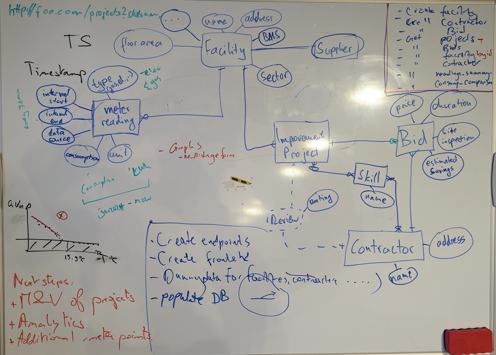

## Development

### Dependencies

Python 3.12, with the following packages:

```bash
pip install fastapi uvicorn[standard] httpx gql pydantic-settings sqlalchemy psycopg[binary] psycopg2-binary alembic
```

You can install them like so:
```bash
python -m venv .venv
source .venv/bin/activate
pip install -r requirements.txt
```

### Deploying for development

Create a file called `.env` in the root of the project.
For reference, you can use the provided `example.env` file:

```bash
cp example.env .env
```

To start the docker container stack, run:

```bash
sudo docker-compose up --build --force-recreate --remove-orphans
```

This will start the FastAPI app and database.

To view the swagger docs, go to [http://localhost:8000/docs/](http://localhost:8000/docs/).
An SQL database browser is available at [http://localhost:8001/](http://localhost:8001/).

#### Running Database Migrations

To create the initial database tables, you will need to run the alembic migrations, like so:

```bash
sudo docker exec -w /app/squidlink/database -it squidlink-app /app/.venv/bin/alembic upgrade head
```

If you want to reset your database, shutdown the docker containers, delete the `.data` volume, and start the containers again.
You will need to run the migrations again:

```bash
sudo docker-compose down
sudo rm -rf .data
sudo docker-compose up --build --force-recreate --remove-orphans
sudo docker exec -w /app/squidlink/database -it squidlink-app /app/.venv/bin/alembic upgrade head
```

## Documentation

Data model:


